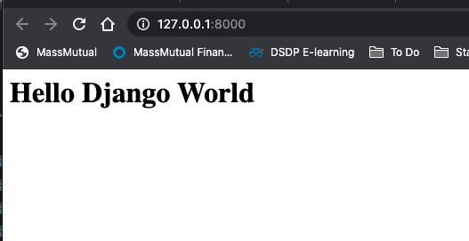
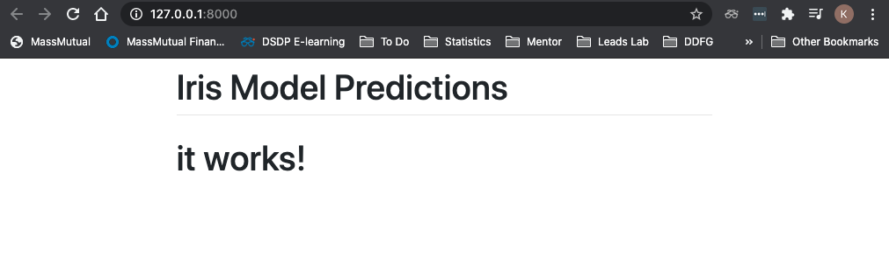

## Django Tutorial
This tutorial creates a Django web app that tests a simple classification model with the `iris` dataset. This tutorial is performed on Mac OS, so some commands may be different for a PC.

#### 1. Install Django
```
pip3 install Django
```
#### 2. Create Django Project
A `Django Project` is a collection of settings for an instance of Django, including database configuration, Django-specific options and application-specific settings. These configurations will be in the `/mysite` directory. You can change `mysite` to any project name you'd like. Tip: avoid using project names like `test` and `Django` - it might mess things up.
```
django-admin startproject mysite . 
```

**This creates the following files:** 
```
├── manage.py           # How you run Django code
└── mysite
    ├── __init__.py     # Tells Python this is a Python code folder
    ├── asgi.py         # Provides hooks for web servers when Django app is deployed
    ├── settings.py     # Configures the Django project
    ├── urls.py         # Routes web requests based on the URL
    └── wsgi.py         # Provides hooks for web servers when Django app is deployed
```
:no_entry_sign: you will rarely edit these files: `manage.py` ,`mysite/__init__.py`, `mysite/asgi.py`, `mysite/wsgi.py`
:white_check_mark: you will edit these files: `mysite/settings.py`, `mysite/urls.py` 

#### 3. Run project for the first time
To see if your project is set up correctly, run:
```
python3 manage.py runserver
```
Then on your browser (Chrome, Safari, Firefox), go to: http://localhost:8000/ . Your screen should look like the following:


To stop your project, hold `control` + `C`.

Running your server for the first time generated a `db.sqlite3` file. This is a default SQLite database for your app.

#### 4. Create a Django App
A `Django App` is a component in a Django project that has a specific purpose, such as a blog, a wiki, or a dashboard. Most Django starter projects only have 1 app (like in this tutorial). Django expects a certain files in each app. The following command creates those files automatically for an app called `iris`.
```
python3 manage.py startapp iris
```
**This creates the following files:** 
```
├── iris
│   ├── __init__.py
│   ├── admin.py        # Defines app admin access to see/edit the database
│   ├── apps.py         # Controls settings specific to the iris app
│   ├── migrations      # Holds files to migrate the database to create and change database schema
│   │   └── __init__.py
│   ├── models.py       # Used to construct the database schema and queries 
│   ├── tests.py        # Provide unit tests for the app
│   └── views.py        # Defines the logic for handling HTTP requests and HTTP responses
```

:no_entry_sign: you will rarely edit these files: `apps.py`

#### 5. Add `iris` app to `mysite/settings.py` `INSTALLED_APPS`

Whenever a new app is installed or created, we must add it to the `INSTALLED_APPS` array in `settings.py`.

Here is what it will look like after `iris` is added:

```
INSTALLED_APPS = [
    'django.contrib.admin',
    'django.contrib.auth',
    'django.contrib.contenttypes',
    'django.contrib.sessions',
    'django.contrib.messages',
    'django.contrib.staticfiles',
    'iris',
]

```

#### 6. Define the SQLite Database Schema
In this example, our database will have one table. The database will store the user-inputted preditions, by saving the inputted features features, the classifier prediction, an auto generated ID, and the current date/time in the database.

Here is an example of the database `Predictions` table:


| id | predict_datetime  |        sepal_length | sepal_width | petal_length | petal_width | prediction |
|----|-------------------|---------------------|-------------|--------------|-------------|------------|
| 1  | 09-11-2020 9:00am | 5.1                 | 3.5         | 1.4          | 0.2         | setosa     |
| 2  | 09-11-2020 9:01am | 4.9                 | 3           | 1.4          | 0.2         | setosa     |
| 3  | 09-11-2020 9:02am | 4.7                 | 3.2         | 1.3          | 0.2         | setosa     |
| 4  | 09-11-2020 9:03am | 4.6                 | 3.1         | 1.5          | 0.2         | setosa     |
| 5  | 09-11-2020 9:04am | 5                   | 3.6         | 1.4          | 0.2         | setosa     |

**Update `iris/models.py` to create the `Predictions` table:**
```
from django.db import models
from django.utils import timezone

# Create your models here.


class Predictions(models.Model):
    # The possible predictions the model can make in the 'predictions' field
    # defined by: (<database name>, <human readible name>)
    PREDICT_OPTIONS = [
        ('setosa', 'Setosa'),
        ('versicolor', 'Versicolor'),
        ('virginica', 'Virginica')
    ]

    # Prediction table fields (or columns) are defined by creating attributes
    # and assigning them to field instances such as models.CharField()
    predict_datetime = models.DateTimeField(default=timezone.now)
    sepal_length = models.DecimalField(decimal_places=2, max_digits=3)
    sepal_width = models.DecimalField(decimal_places=2, max_digits=3)
    petal_length = models.DecimalField(decimal_places=2, max_digits=3)
    petal_width = models.DecimalField(decimal_places=2, max_digits=3)
    prediction = models.CharField(choices=PREDICT_OPTIONS, max_length=10)
```
Notice that `id` was not included. This is because by default, Django gives each model an `id = models.AutoField(primary_key=True)` auto incrimenting primary key. 

Check here: https://www.webforefront.com/django/modeldatatypesandvalidation.html  or here: https://docs.djangoproject.com/en/3.1/topics/db/models/ for more built-in field options. 

#### 7. Create the database with migrations
Although `models.py` determines the database schema, you must **migrate the database** for these changes to be in affect. 

You must migrate in the following scenarios:
1. Adding a Model (aka Table)
2. Adding a Field (aka Column in Table)
3. Removing a Field
4. Changing a Field Schema

```
python3 manage.py makemigrations
python3 manage.py migrate
```

#### 8. Use admin mode to see/edit database
First you must **register your model** with Django admin. To do this, edit the `iris/admin.py` file with the following:
```
from django.contrib import admin
from .models import Predictions

@admin.register(Predictions)
class PredictionsAdmin(admin.ModelAdmin):
    pass

```

Now, **create a superuser** with the following command:
```
python3 manage.py createsuperuser
```
!! Do not forget your admin username/password !!

To **access the admin site** run the server and then go to: http://localhost:8000/admin
```
python3 manage.py runserver
```
You should see the following login where you can enter your credentials:


Once you enter your admin credentials, you should see your "Predictions" table under "IRIS". You can add to your table by clicking the "Add" button and entering a new row in your database. 


#### 9. Add the landing page to the app
The file `mysite/urls.py` determines which view function the HTTP request will map to when the client makes a URL request. For example, in the local django web app, the home page will load with the URL `http://localhost:8000/` or a URL path of `''`. When this happens, we want to map to the `home()` function in `iris/views.py` to render the home page. 

To do this, **change the `mysite/urls.py` to the following**:
```
from django.contrib import admin
from django.urls import path
from iris import views

urlpatterns = [
    path('admin/', admin.site.urls),
    path('', views.home, name='home'),
]
```

Now, we must **add the home() function to `iris/views.py`**:
```
from django.shortcuts import render


def home(request):
    return render(request, 'home.html')
```

Finally, we need to create a `home.html` file to render for the landing page. To do this, add the following file `iris/templates/home.html`. Notice we are creating a new `templates/` folder.

In `iris/templates/home.html`, add this:
```
<h1>Hello Django World</h1>
```

Check your new landing page works with:
```
python manage.py runserver
```
You should see:
</img>

#### 10. Make the landing page fancy with Bootstrap
[Bootstrap](https://getbootstrap.com/) is a CSS framework that makes front end development easier than ever. To add Bootstrap to your app, an easy way is to copy the following into a new `iris/templates/base.html` file. 
```
<!doctype html>
<html lang="en">

<head>
    <meta charset="utf-8">
    <meta name="viewport" content="width=device-width, initial-scale=1, shrink-to-fit=no">
    <link rel="stylesheet" href="https://stackpath.bootstrapcdn.com/bootstrap/4.1.3/css/bootstrap.min.css"
        integrity="sha384-MCw98/SFnGE8fJT3GXwEOngsV7Zt27NXFoaoApmYm81iuXoPkFOJwJ8ERdknLPMO" crossorigin="anonymous">
</head>

<body>
    <div class="container">
        <div class="row justify-content-center">
            <div class="col-8">
                <h1 class="mt-2">Iris Model Predictions</h1>
                <hr class="mt-0 mb-4">
                
                
            </div>
        </div>
    </div>
</body>

</html>
```

Update `iris/templates/home.html` to the following:
```



<h1>it works!</h1>

```
Your landing page should look like this after doing `python3 manage.py runserver`:
</img>

#### 11. Create a machine learning model with the Iris dataset
In this tutorial, we are going to write a simple machine learning model and deploy it in our Django web app. 

We are using the Iris dataset and Decision Trees for a multiclass classifier. 

To create the model, first install Scikit-learn:
```
pip install -U scikit-learn
```

Add this script to a new folder in the root directory `ml_model/iris_model.py`. **Note: this is not a machine learning tutorial** and the model is super basic. The model should be revised with things like train/test splits, cross validation, hyperparameter tuning, etc. to be more robust.

```
from sklearn import datasets
from sklearn.tree import DecisionTreeClassifier
import pickle

# Load the Iris dataset
iris = datasets.load_iris()
X = iris.data  # we only take the first two features.
y = iris.target

# Train a Decision Tree Classifier
clf = DecisionTreeClassifier(random_state=0)
clf.fit(X, y)

# Save the model as a pkl file
filename = 'ml_model/iris_model.pkl'
pickle.dump(clf, open(filename, 'wb'))
```

Run the script with:
```
python3 ml_model/iris_model.py
```
and it should create an `ml_model/iris_model.pkl` file. This is a serialized version of the trained classifier. 

