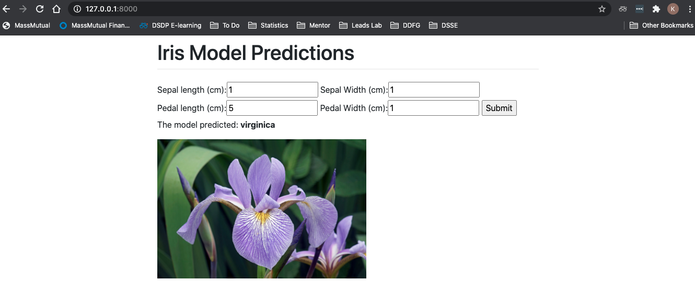

## Django with Scikit-Learn Tutorial
This tutorial creates a Django web app that tests a simple classification model with the `iris` dataset. This tutorial is performed on Mac OS, so some commands may be different for a PC.

#### To run locally
```
pip3 install -r requirements.txt
python3 manage.py runserver
```

In this tutorial, you will integrate a Decision Tree Classifier on the Iris dataset with a Django web app!

